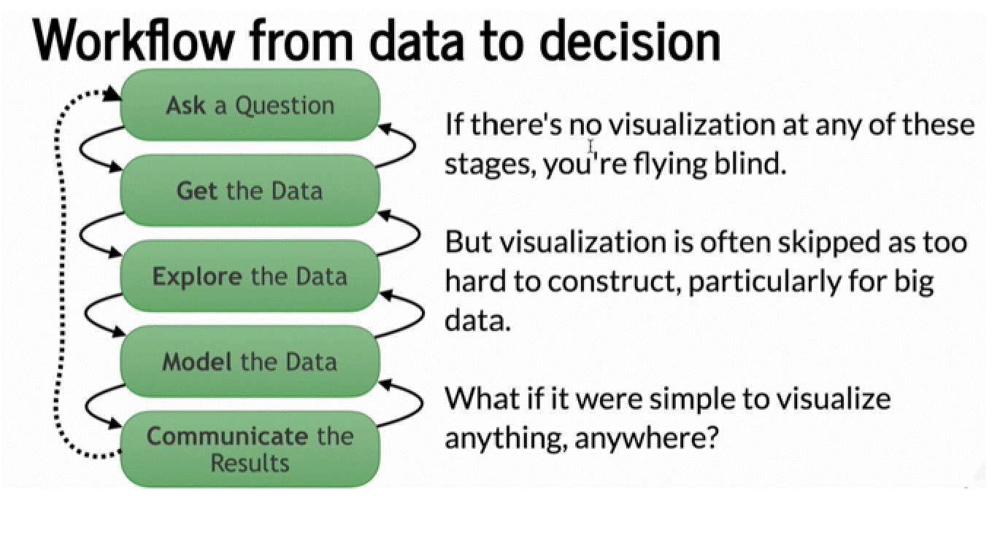

# Unit 6 - Pythonic Monopoly
[PYVIZ ASSIGNMENT - 06](Starter_Code/rental_analysis.ipynb)

## Background

Harold's company has just started a new Real Estate Investment division to provide customers with a broader range of portfolio options. Harold was tasked with building a prototype dashboard and he needs your help. The real estate team wants to trial this initial offering with investment opportunities for the San Francisco market. If the new service is popular, then they can start to expand to other markets.

The goal of this dashboard is to provide charts, maps, and interactive visualizations that help customers explore the data and determine if they want to invest in rental properties in San Francisco.

Click below to view the homework assignment:

[PYVIZ ASSIGNMENT - 06](Starter_Code/rental_analysis.ipynb)

© 2021 Trilogy Education Services, a 2U, Inc. brand. All Rights Reserved.
